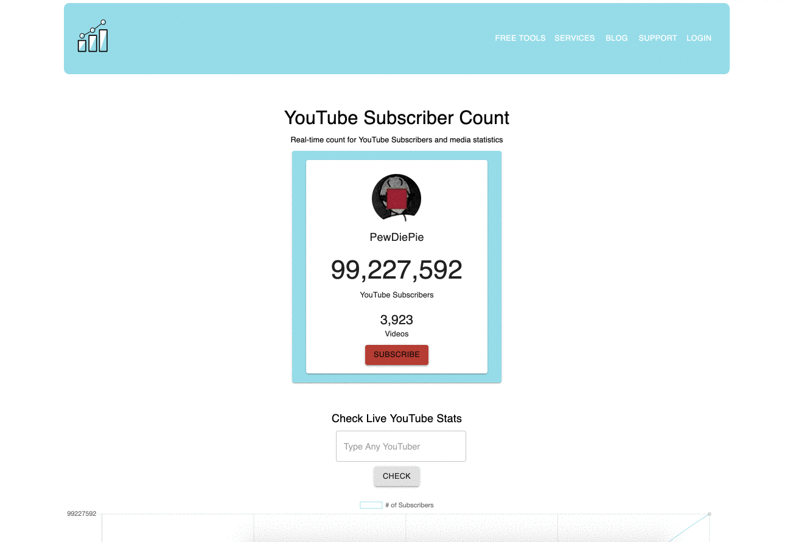

# youtube-realtime-tracker

## To build:
### For development:
npm run build-dev

### For production:
npm run build-prod

## To start:
npm start

### note: API configuration
config/config.example.js -> config/config.js
 
https://console.developers.google.com/cloud-resource-manager

## Demo

